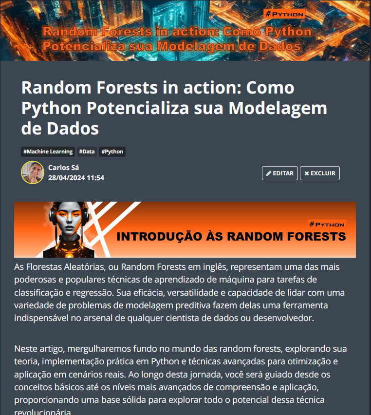

    

  
  

-------

  

# Projeto artigo técnico gerado por I.A.s

 > ℹ️ **NOTE:** Este é o repositório desenvolvido durante o curso no qual fui instrutor técnico na plataforma da [DIO](https://dio.me).

  

Projeto com o objetivo de gerar um artigo técnico com um layout rico, leitura agradável e com foco em promover sua autoridade técnica.

<a href="https://web.dio.me/articles/random-forests-in-action-como-python-potencializa-sua-modelagem-de-dados?back=%2Farticles&open-modal=true&page=1&order=oldest" title="View PDF now"> 📕Clique aqui para ler o artigo</a>

## 💻 Tecnologias utilizadas no projeto

- [ChatGPT](https://chat.openai.com/) - para título e conteúdo
- [Lexica.art](https://lexica.art/) - para gerar imagens
- [PowerPoint](https://www.microsoft.com/en/microsoft-365/powerpoint) - Para formatação de banners e Layouts

## 📄 Prompts e ferramentas

ChatGPT：

|   Ação   | prompt                                                                                                                                                                                                                                                                         |
| :------: | ------------------------------------------------------------------------------------------------------------------------------------------------------------------------------------------------------------------------------------------------------------------------------ |
|  título  | Crie 10 headlines para nomes de artigos sobre o assunto Angular - Diretivas                                                                                                                                                                                                    |
| conteúdo | Crie um título de um artigo sobre random forests usando python {REGRAS} o artigo será sobre random forests usando a linguagem python e irá conter explicações detalhadas e técnicas com exemplos reais de código sobre o assunto o título deverá ser chamativo e apelativo O título deve ser em português mas "Random forests" não deve ser traduzido dê 5 opções de títulos |
| conteúdo | Utilizando o Título 5, defina os blocos do artigo {REGRAS} o artigo será sobre random forests usando a linguagem python e irá conter explicações detalhadas e técnicas com exemplos reais de código sobre o assunto Os blocos deverão estar organizados em ordem de aprendizado O conteúdo do artigo irá abordar desde o início até o nível avançado sobre o assunto |
| conteúdo | Desenvolva o bloco 1 do artigo {REGRAS} o artigo será sobre random forests usando a linguagem python e irá conter explicações detalhadas e técnicas com exemplos reais de código sobre o assunto Deverá ser um conteúdo extenso |
| conteúdo | Desenvolva o bloco 2 do artigo {REGRAS} o artigo será sobre random forests usando a linguagem python e irá conter explicações detalhadas e técnicas com exemplos reais de código sobre o assunto Deverá ser um conteúdo extenso |
| conteúdo | Desenvolva o bloco 3 do artigo {REGRAS} o artigo será sobre random forests usando a linguagem python e irá conter explicações detalhadas e técnicas com exemplos reais de código sobre o assunto Deverá ser um conteúdo extenso |
| conteúdo | Desenvolva o bloco 4 do artigo {REGRAS} o artigo será sobre random forests usando a linguagem python e irá conter explicações detalhadas e técnicas com exemplos reais de código sobre o assunto Deverá ser um conteúdo extenso |
| conteúdo | Desenvolva o bloco 5 do artigo {REGRAS} o artigo será sobre random forests usando a linguagem python e irá conter explicações detalhadas e técnicas com exemplos reais de código sobre o assunto Deverá ser um conteúdo extenso |
| conteúdo | Desenvolva o bloco 6 do artigo {REGRAS} o artigo será sobre random forests usando a linguagem python e irá conter explicações detalhadas e técnicas com exemplos reais de código sobre o assunto Deverá ser um conteúdo extenso |
| conteúdo | Desenvolva o bloco 7 do artigo {REGRAS} o artigo será sobre random forests usando a linguagem python e irá conter explicações detalhadas e técnicas com exemplos reais de código sobre o assunto Deverá ser um conteúdo extenso |

Lexica.art：

- No léxica utilizamos o acervo público de imagens geradas por outras pessoas, os termos de pesquisa que utilizei durante a gravação do conteúdo foram:

• orange synthwave woman

## ✨ Features

- Conteúdo gerado via ChatGPT
- Imagens do acervo público geradas via Lexica.art

## 📚 Materiais

- prompts utilizados

## 🛠️ Instruções de execução

Utilize os prompts acima nas ferramentas sugeridas para gerar o material base e utilize uma ferramenta de edição de documentos como power point, libreoffice , indesign para diagramação, o passo a passo em vídeo pode ser conferido na plataforma da [DIO](https://dio.me).

## 👨‍💻 Expert

    
&nbsp&nbsp&nbspCarlos Rosa 
    &nbsp&nbsp&nbsp
    <a href="https://github.com/Synth-ShellZ">
    GitHub</a>&nbsp;|&nbsp;
    <a href="www.linkedin.com/in/carlos-eduardo-rosa-6b6a5b280">LinkedIn</a>
&nbsp;|&nbsp;
    <a href="https://www.instagram.com/eeduardorosa/">
    Instagram</a>
&nbsp;|&nbsp;

  

---
⌨️ com 💜 por [Carlos Rosa](https://github.com/Synth-ShellZ)
